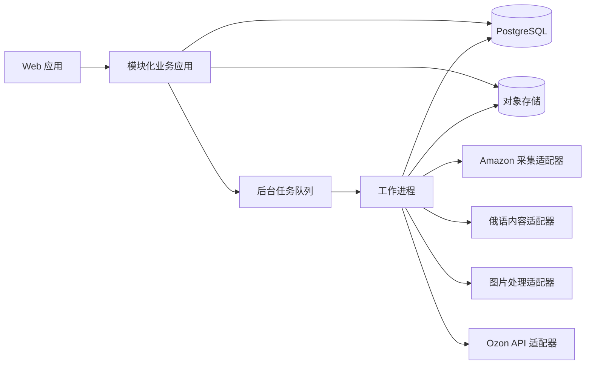

# Amazon 商品本地化与 Ozon 上架工具 MVP 设计

## 1. 文档目的

本文档定义 E-commerce Tools 第一版内部试用产品的业务范围、系统设计、页面流程、数据边界、外部能力验证、错误处理和验收标准。

第一版不是演示页面，也不是正式多租户 SaaS。它必须让内部运营人员完成一个真实商品的端到端闭环：

```text
Amazon 美国站商品链接
→ 采集链接对应变体
→ 提取并整理商品事实
→ 生成俄语文案和图片方案
→ 映射 Ozon 类目与属性
→ 人工审核和补充
→ 保存 Ozon 草稿或正式提交
→ 记录结果和错误
```

## 2. 已确认的产品决策

| 决策项 | 第一版结论 |
|---|---|
| 产品目标 | 单商品端到端内部试用版 |
| 首个类目 | 家具收纳凳 |
| Amazon 站点 | 美国站 `amazon.com` |
| 测试样本 | `测试链接.xlsx` 中的 14 个链接，剔除经核实不属于收纳凳的样本 |
| Amazon 变体 | 读取链接当前变体，并要求用户再次确认颜色、尺寸和对应图片 |
| 商品字段 | 优先从 Amazon 自动提取，无法确认的字段由用户补充 |
| 图片来源 | Amazon 图片和用户上传的供应商原图均可使用 |
| 权利确认 | 发布前要求用户确认拥有图片、品牌、文案和商品销售的相关权利 |
| Ozon 环境 | 已有一个真实卖家店铺及可联调的 API 凭证 |
| 使用人员 | 少量内部人员独立账号，共用一个 Ozon 店铺 |
| 角色 | 管理员、运营人员、审核人员 |
| 发布动作 | 可选择保存草稿或正式提交，默认保存草稿 |
| 日处理量 | 10～30 个商品任务 |
| 系统形态 | 模块化单体加后台任务 |
| 实施方式 | 开发阶段拆成多个独立 Codex 任务，主任务负责协调与验收 |

## 3. 第一版范围

### 3.1 包含

- 内部账号登录、角色权限和操作留痕。
- 创建单个 Amazon 商品任务。
- 采集 Amazon 当前变体的标题、ASIN、品牌、图片、文案、规格和变体信息。
- 保存 Amazon 原始页面快照和字段来源。
- 将商品信息归一为结构化商品事实。
- 将字段区分为来源明确、AI 建议、人工填写、缺失和冲突。
- 生成 Ozon 使用的俄语标题、卖点、描述、图片文字和搜索关键词建议。
- 生成 2～3 套商品图片候选方案。
- 推荐 Ozon 类目，映射必填属性、单位和枚举值。
- 在统一审核工作台修改内容、选择图片和补充字段。
- 保存 Ozon 草稿或正式提交。
- 查询并记录发布结果、错误字段和重试记录。
- 任务状态、素材版本、审核记录和操作日志。

### 3.2 不包含

- 自动选品、销量预测和利润预测。
- 批量提交多个 Amazon 链接。
- 多个 Ozon 店铺或多租户组织体系。
- 自动把一个 Amazon 父商品转换成完整 Ozon 多变体商品。
- 工具类和其他家具三级类目。
- 自动采购、订单处理、库存同步和动态调价。
- 无人审核的自动发布。
- 修改商品主体或生成原图未展示的角度。
- 正式 SaaS 计费、套餐和客户组织管理。

## 4. 总体架构

第一版使用模块化单体。账号、任务、商品事实、内容、图片、审核和发布属于同一个业务应用，共享数据库事务和统一权限体系。采集、AI 生成、图片处理、Ozon 提交和状态回查通过后台任务异步执行。



### 4.1 技术边界

- Web 前端：TypeScript 和 React，用于任务中心、商品工作台、审核和发布界面。
- 业务后端：TypeScript 模块化服务，按业务能力分模块，不按控制器、服务、数据库等纯技术层拆成大型共享目录。
- 数据库：PostgreSQL，保存业务状态、字段来源、版本、审核和发布记录。
- 任务队列：Redis 支撑的持久后台队列，任务必须可重试、可查询、可恢复。
- 文件存储：S3 兼容对象存储，保存原图、上传图、生成图和最终图。
- 外部能力：Amazon、文本生成、图片处理和 Ozon 均通过适配器接入。
- 部署方式：容器化部署 Web、业务应用、后台工作进程、PostgreSQL、Redis 和对象存储依赖。

具体文本和图片服务商由验证阶段按准确性、主体保持能力、延迟、成本和可用性选择。核心业务只依赖适配器接口，不依赖特定服务商的数据结构。

### 4.2 业务模块

| 模块 | 职责 |
|---|---|
| 身份与权限 | 登录、用户、角色、会话和店铺凭证访问控制 |
| 任务中心 | 创建任务、状态机、负责人、进度和失败恢复 |
| Amazon 采集 | URL 解析、当前变体采集、原始快照和来源保存 |
| 商品事实 | 字段归一、单位转换、来源、置信状态和冲突管理 |
| 俄语内容 | 商品事实输入、俄语生成、事实约束和版本管理 |
| 图片生产 | 原图管理、主体分离、模板与场景方案、主体一致性检查 |
| Ozon 映射 | 类目推荐、属性定义、枚举标准化和必填校验 |
| 人工审核 | 修改、补充、风险提示、通过和退回 |
| Ozon 发布 | 草稿、正式提交、状态回查、错误映射和幂等控制 |
| 审计日志 | 关键读取、修改、审核、提交和凭证相关操作留痕 |

## 5. 核心数据设计

### 5.1 主要实体

| 实体 | 关键内容 |
|---|---|
| User | 用户、角色、启停状态 |
| StoreConnection | 单个 Ozon 店铺、加密凭证和连接状态 |
| ProductTask | Amazon URL、ASIN、状态、负责人和目标店铺 |
| SourceSnapshot | 原页面数据、采集时间、页面来源和采集版本 |
| ProductVariant | 当前 ASIN、颜色、尺寸、价格、图片和变体关系 |
| ProductFact | 标准字段、值、单位、来源、状态和人工确认结果 |
| ContentVersion | 俄语标题、卖点、描述、关键词、生成参数和修改人 |
| ImageAsset | 原始图、上传图、生成图、用途、文件哈希和来源 |
| ImageProposal | 图片方案、模板、俄语文字、主体检查和审核状态 |
| OzonDraft | Ozon 类目、属性、SKU、价格、库存和待提交载荷 |
| ReviewDecision | 审核人、检查项、结论、退回原因和时间 |
| PublicationAttempt | 动作、幂等键、请求摘要、响应、错误和 Ozon 商品编号 |
| BackgroundJob | 步骤、尝试次数、状态、错误和上下游任务关系 |
| AuditEvent | 操作人、操作类型、目标实体、前后差异和时间 |

### 5.2 商品字段状态

每个 ProductFact 必须具有以下状态之一：

| 状态 | 含义 | 是否可直接发布 |
|---|---|---|
| `confirmed_source` | Amazon 页面或用户原始资料明确支持 | 可以 |
| `confirmed_manual` | 用户已明确填写或确认 | 可以 |
| `suggested` | 系统可以推断，但未获得人工确认 | 不可以 |
| `missing` | 没有可用值 | 不可以 |
| `conflict` | 多个来源值相互冲突 | 不可以 |

最终提交只读取已确认状态的字段。AI 建议不得静默覆盖来源值或人工值。

### 5.3 版本与来源

- Amazon 每次重新采集生成新的 SourceSnapshot，不覆盖历史快照。
- AI 每次生成和用户每次保存形成新的 ContentVersion。
- 图片文件不可原地覆盖；修改产生新 ImageAsset 或 ImageProposal。
- 人工确认值优先于自动提取值，但自动提取值仍保留用于审计。
- 所有发布载荷保存不可变摘要，以便复现提交内容。

## 6. 后台任务与状态机

### 6.1 商品任务状态

```text
待采集
→ 采集中
→ 待确认变体
→ 内容处理中
→ 图片生成中
→ 待人工审核
→ 待发布
→ 发布中
→ 已发布 / 发布失败 / 已放弃
```

状态只能由负责该步骤的业务模块推进。后台任务不能跳过人工确认状态。

### 6.2 后台步骤

1. 规范化 Amazon URL 并提取 ASIN。
2. 采集页面、当前变体和素材。
3. 归一商品事实并识别缺失或冲突。
4. 等待用户确认变体。
5. 生成俄语内容。
6. 生成图片方案并执行主体一致性检查。
7. 推荐 Ozon 类目并映射属性。
8. 等待人工审核和补充阻断字段。
9. 构造 Ozon 草稿载荷。
10. 保存草稿或正式提交。
11. 查询 Ozon 状态并保存结果。

每个步骤使用稳定幂等键。重试不得重复创建下游实体、重复上传相同文件或重复提交商品。

## 7. 产品页面和用户流程

### 7.1 登录与账号管理

- 管理员创建、停用和分配内部账号。
- 运营人员创建和编辑商品任务。
- 审核人员通过、退回和提交商品。
- 管理员可以执行全部操作并查看审计记录。

### 7.2 任务中心

显示商品、ASIN、当前变体、负责人、状态、阻断项数量、失败摘要和更新时间。支持按状态、负责人和创建时间筛选。

### 7.3 创建任务

用户填写单个 Amazon 美国站链接。目标店铺固定为已连接的单个 Ozon 店铺。价格、库存、重量和包装尺寸优先自动提取，无法确认时允许稍后补充。

### 7.4 变体确认

并排展示 Amazon 当前变体、颜色、尺寸、图片、价格和关键规格。用户必须确认这些内容属于同一变体，才能开始内容与图片生成。

### 7.5 商品处理工作台

工作台包含四个区域：

1. Amazon 原始资料和来源。
2. 俄语标题、卖点、描述和关键词。
3. 原始图片、供应商图片和 2～3 套候选方案。
4. Ozon 类目、属性、SKU、价格、库存和包装信息。

每个字段显示值、来源、状态和最近修改人。

### 7.6 人工审核

审核页集中显示以下阻断项：

- 当前变体未确认或存在混用风险。
- 必填字段缺失或冲突。
- 商品主体一致性检查失败。
- 俄语内容包含未确认声明。
- Ozon 类目或枚举值不合法。
- 用户未完成图片、品牌、文案和销售权确认。

审核结果包括通过、保存草稿、退回文案、退回图片和放弃上架。

### 7.7 发布确认与结果

发布动作默认为保存 Ozon 草稿，也允许审核人员选择正式提交。结果页显示 Ozon 商品编号、审核状态、错误字段、失败原因和重新提交历史。

## 8. 内容与图片规则

### 8.1 俄语内容

生成过程为：提取商品事实、删除 Amazon 专属表达、翻译与本地化、按 Ozon 结构重写、人工审核。

生成器只能使用已确认商品事实。建议状态字段可以作为明确标注的候选内容展示，但不能进入最终发布载荷。

### 8.2 图片处理

允许修改背景、场景、装饰、留白、俄语排版、图标和输出尺寸。禁止修改商品形状、结构、比例、颜色、材质、纹理、品牌、型号、配件数量、接口和真实功能。

图片方案分为：

1. 简洁电商风。
2. 俄罗斯本地化场景风。
3. 功能与参数说明风。

如果主体无法可靠分离、主体一致性检查失败或原图不足以支持目标角度，方案自动标为不合格并转人工处理。

## 9. 外部能力验证

全面开发前先完成三项独立验证。

### 9.1 Amazon 采集验证

- 使用有效收纳凳样本检查 ASIN、当前变体、图片、尺寸、材质和描述。
- 记录每个字段的获取结果、来源和失败原因。
- 重点检查颜色、尺寸、图片和参数是否属于同一变体。
- 将样本划分为开发、回归和盲测三组。

通过条件：盲测样本中不出现已知的跨变体混用；无法确认的字段被正确标记而非猜测。

### 9.2 图片生产验证

- 选择 3～5 个结构、颜色和图片类型不同的收纳凳。
- 测试主体分离、背景替换、俄语排版和主体一致性检查。
- 比较不同服务商或模板路径的准确性、成本和处理时间。

通过条件：至少一种方案能够稳定产出可人工审核的图片；所有自动通过图片保持商品主体一致。

### 9.3 Ozon 接口验证

- 读取收纳凳目标类目的必填属性和枚举值。
- 测试草稿、正式提交、状态查询、字段错误和重试。
- 测试同一幂等键重复调用不会产生重复商品或 SKU。

通过条件：有效载荷可以完成目标动作；无效载荷能定位错误字段；超时后可以安全查询并决定是否重试。

## 10. 错误处理

| 失败环节 | 系统行为 |
|---|---|
| Amazon 页面无法采集 | 保留任务，允许重新采集或人工上传资料 |
| 变体冲突 | 阻止继续生成，要求用户确认 |
| 商品字段缺失 | 生成不依赖该字段的内容，但阻止最终提交 |
| 文案生成失败 | 只重试文案步骤 |
| 单张图片生成失败 | 只重试该图片或切换模板 |
| 主体一致性失败 | 标记图片不合格并阻止选用 |
| Ozon 接口超时 | 先查询原请求结果，再决定是否重试 |
| Ozon 校验失败 | 映射具体字段，修改后复用原任务提交 |
| 工作进程中断 | 从最后一个已完成步骤恢复 |

技术错误对用户显示可执行说明；完整错误细节进入受控日志。凭证、令牌和敏感请求头不得进入普通日志。

## 11. 权限、安全与合规

- Ozon 凭证加密保存，只有发布适配器在执行时可以解密使用。
- 页面、普通日志和导出内容不显示完整凭证。
- 审核和发布动作要求有相应角色。
- 发布前必须确认图片与实际商品一致，并确认相关使用权和销售权。
- 评论、买家图片和未授权品牌宣传素材不得进入自动素材池。
- 评论、配送、会员和促销信息不得进入商品草稿。
- 审计事件不可由普通运营人员修改或删除。

## 12. 验收标准

### 12.1 Amazon 采集

- 正确识别有效样本的 ASIN 和当前变体。
- 当前颜色、尺寸、价格、图片和规格不混入其他变体。
- 无法确认的字段标为建议、缺失或冲突。
- 每个自动值具有可回查来源。

### 12.2 俄语内容

- 不增加来源中不存在的功能、材质、尺寸或性能。
- 不包含 Amazon 专属促销、配送或会员表达。
- 正式发布版本经过人工审核。
- AI 输出和人工修改均可回溯。

### 12.3 图片

- 每个商品生成 2～3 套候选方案。
- 至少一套可以在人工调整后用于 Ozon。
- 所有获准使用的图片保持商品结构、比例、颜色、纹理、配件和品牌一致。
- 主体检查失败的图片不能进入 Ozon 草稿。

### 12.4 Ozon

- 所有必填属性具有已确认值，或界面明确阻止提交。
- 草稿和正式提交返回明确结果。
- 字段错误能够定位并修改。
- 相同任务重试不产生重复商品或 SKU。
- 成功后保存 Ozon 商品编号和完整提交记录。

### 12.5 端到端盲测

至少选择 3 个未参与日常开发调试的有效收纳凳样本，完整执行：

```text
Amazon 链接
→ 变体确认
→ 俄语内容
→ 图片方案
→ Ozon 属性补充
→ 人工审核
→ Ozon 草稿或正式提交
```

三个样本均须到达明确的 Ozon 结果。任何变体混用、虚构参数、重复商品、未经确认的主体变化或凭证泄露均为阻断上线问题。

性能验收以每天 10～30 个任务为业务基线。验证阶段记录每个步骤的实际耗时和成本，形成容量数据后再确定正式服务时限；第一版不以未经测量的固定分钟数作为上线条件。

## 13. 实施拆分原则

真正开发时使用独立 Codex 任务承接以下工作：

1. Amazon 采集与变体准确性。
2. Ozon 类目、属性和发布接口。
3. 商品事实模型、来源与版本。
4. 俄语文案生成和事实约束。
5. 图片处理、模板和主体一致性。
6. 账号、任务中心和审核工作台。
7. 端到端集成、回归和盲测验收。

第一批并行验证 Amazon、Ozon 和图片外部能力。验证结果确定数据约束后，再实现核心数据模型、业务页面和内容流程。主任务只保存已批准的设计、跨任务接口和验收结果，避免依赖各子任务的隐含上下文。

## 14. 设计完成条件

本设计在满足以下条件后进入实施计划阶段：

- 用户确认本文档反映已经讨论并认可的产品范围。
- 测试链接中不属于收纳凳的样本在验证前被标记或移除。
- 实施计划把三项外部验证作为正式功能开发的前置门槛。
- 每个实施任务具有明确文件范围、接口、测试步骤和独立验收结果。

